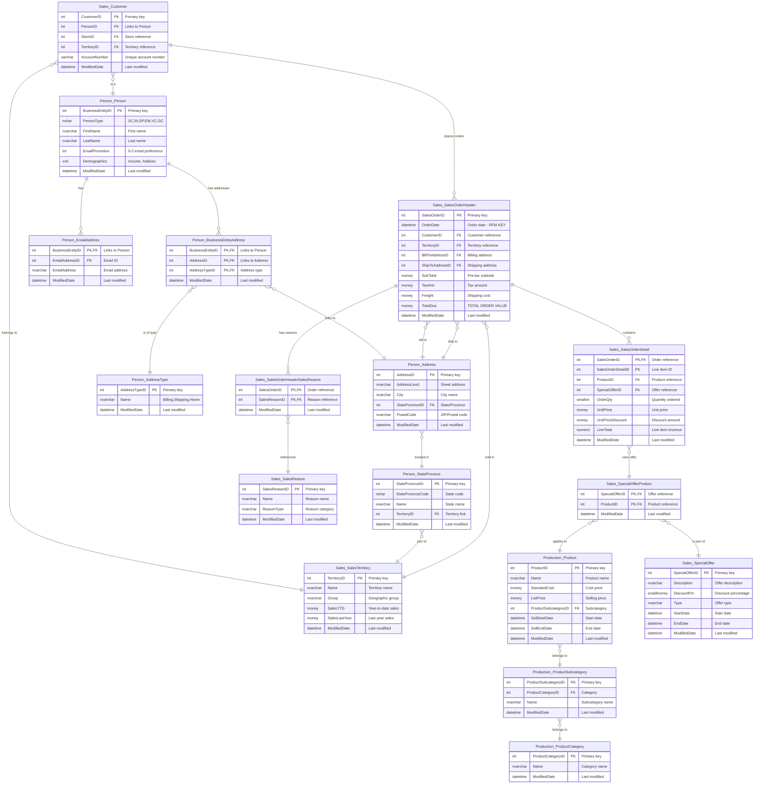

# 🗺️ Interactive ERD: Customer Analytics Model

**Purpose**: Visual representation of the 17 core tables used for customer analytics in AdventureWorks 2025.

**Quick Links**:
- 📖 [Data Dictionary](./adventureworks-customer-analytics-data-dictionary.md) - Complete column descriptions
- 📋 [Table Selection Methodology](./table-selection-methodology.md) - How these tables were chosen
- 💾 [DBML Source](./erd-customer-analytics-enhanced.dbml) - Original ERD definition for dbdiagram.io

---

## 📊 Entity Relationship Diagram

---

## 📋 Table Categories

### 🟦 **Dimension Tables (9)**

Customer & demographic attributes that answer "WHO":

| Schema | Table | Purpose |
|--------|-------|---------|
| Sales | Customer | Customer master - RFM/CLV driver |
| Person | Person | Demographics (name, email promo preference) |
| Person | EmailAddress | Contact information for campaigns |
| Person | Address | Geographic analysis |
| Person | StateProvince | State/province dimension |
| Sales | SalesTerritory | Regional CLV and segmentation |
| Production | Product | Product catalog |
| Production | ProductSubcategory | Product hierarchy |
| Production | ProductCategory | Top-level categories |

### 🟩 **Fact Tables (2)**

Transactional data that answers "WHAT happened":

| Schema | Table | Grain | Key Metrics |
|--------|-------|-------|-------------|
| Sales | SalesOrderHeader | Order | OrderDate (RFM), TotalDue (Monetary), CustomerID (Frequency) |
| Sales | SalesOrderDetail | Line item | OrderQty, UnitPrice, LineTotal |

### 🟨 **Bridge Tables (6)**

Many-to-many relationship resolvers:

| Schema | Table | Purpose |
|--------|-------|---------|
| Person | BusinessEntityAddress | Links persons to addresses |
| Person | AddressType | Address type lookup |
| Sales | SpecialOffer | Promotion metadata |
| Sales | SpecialOfferProduct | Links offers to products |
| Sales | SalesOrderHeaderSalesReason | Links orders to reasons |
| Sales | SalesReason | Purchase motivation lookup |

---

## 🎯 How This ERD Answers the 7 Strategic Questions

### Q1: Who are our most valuable customers?
**Tables**: `Customer` → `SalesOrderHeader` → `SalesOrderDetail`  
**Metrics**: TotalDue (Monetary), COUNT(SalesOrderID) (Frequency), OrderDate (Recency)

### Q2: Which customers are unprofitable or risky?
**Tables**: `Customer` + `SalesOrderHeader` + `SalesOrderDetail`  
**Metrics**: Recency (DATEDIFF), Frequency (COUNT), Discount rate (UnitPriceDiscount)

### Q3: How do customers differ in behavior?
**Tables**: `Customer` + `SalesOrderHeader` + `Product` + `ProductCategory`  
**Metrics**: RFM scores, Basket size (AVG OrderQty), Category diversity

### Q4: Are newer customer cohorts better or worse?
**Tables**: `Customer` + `SalesOrderHeader`  
**Metrics**: Cohort (MIN OrderDate), Retention rate, Revenue per cohort

### Q5: Who is likely still active vs "dead"?
**Tables**: `Customer` + `SalesOrderHeader`  
**Metrics**: Last purchase date, Inter-purchase time, BTYD inputs

### Q6: What actions should we take?
**Tables**: `Customer` + `SalesOrderHeader` + `SpecialOffer` + `SpecialOfferProduct`  
**Metrics**: Predicted CLV, Discount response, Incremental lift

### Q7: What is the value of our customer base (CBCV)?
**Tables**: All tables (aggregated)  
**Metrics**: Aggregated CLV, Retention curves, Cohort performance

---

## 🔗 Relationship Cardinalities

| Relationship | Type | Description |
|-------------|------|-------------|
| Customer → Person | Many-to-One | Each customer links to one person |
| Customer → SalesOrderHeader | One-to-Many | Each customer has multiple orders |
| SalesOrderHeader → SalesOrderDetail | One-to-Many | Each order has multiple line items |
| SalesOrderDetail → SpecialOfferProduct | Many-to-One | Line items reference offer+product combo |
| Product → ProductSubcategory | Many-to-One | Products belong to subcategories |
| Person → EmailAddress | One-to-Many | Persons can have multiple emails |
| Address → StateProvince | Many-to-One | Addresses are in one state/province |

---

## 💡 Usage Tips

1. **Click any table** in the diagram to focus on it
2. **Zoom in/out** using browser controls (Ctrl/Cmd + Mouse wheel)
3. **View DBML source** at [erd-customer-analytics-enhanced.dbml](./erd-customer-analytics-enhanced.dbml) for detailed field definitions
4. **Check data dictionary** at [adventureworks-customer-analytics-data-dictionary.md](./adventureworks-customer-analytics-data-dictionary.md) for column descriptions

---

## 📝 Notes

- **PK** = Primary Key
- **FK** = Foreign Key
- **Composite PKs** marked as `PK,FK` when column is both
- **Key date column**: `SalesOrderHeader.OrderDate` drives all temporal analysis
- **Key monetary column**: `SalesOrderHeader.TotalDue` drives CLV calculations

---

**Last Updated**: 2026-02-07  
**Source**: AdventureWorks 2025 Database  
**Scope**: 17 tables optimized for Q1-Q7 customer analytics
